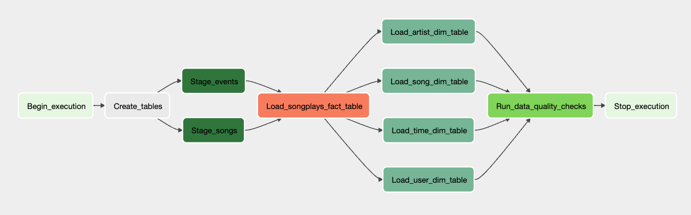

# Automated Data Pipeline with Airflow for Sparkify

## Introduction
Sparkify, a music streaming company, has embarked on an initiative to automate and monitor their data warehouse ETL pipelines using Apache Airflow.

## Project Overview
This project involves creating dynamic, reusable data pipelines that are monitorable and facilitate easy backfilling.
Ensuring data quality is crucial, as analyses performed on the data warehouse rely on the integrity of the data. 
The project will use custom Airflow operators for tasks like staging data, filling the data warehouse, and conducting data quality checks.

The source data resides in S3 and needs to be processed in Sparkify's data warehouse in Amazon Redshift. 
The source datasets consist of JSON logs that tell about user activity in the application and JSON metadata about the songs the users listen to.

## Getting Started

1. **Clone the Repository**: Clone this repository to get the project files.
2. **Set Up Airflow**: Ensure Apache Airflow is properly installed and configured. 
3. **Configure Airflow Connections**: Set up the necessary connections in Airflow for Amazon Redshift and AWS S3. 
4. **Deploy the DAG**: Place the DAG file in the Airflow DAGs folder and start the Airflow scheduler. 
5. **Monitor the Pipeline**: Use Airflow's UI to monitor the pipeline's execution and troubleshoot as necessary.

## Structure

* `dags/sparkify_dag.py` contains the main and only DAG for this project.
* `dags/operators` folder containing all the custom operators:
  * **Data Stage Operator** (`stage_redshift.py`): Loads JSON formatted files from S3 to Amazon Redshift.
  * **Fact Operator** (`load_fact.py`): Utilizes the provided SQL helper class to run data transformations for fact table.
  * **Dimension Operator** (`load_dimension.py`): Utilizes the provided SQL helper class to run data transformations for dimension tables.
  * **Data Quality Operator** (`data_quality.py`): Runs checks on the data to identify discrepancies post-ETL.
* `dags/create_tables.sql` contains sql statements for creating fact and dimension tables.
* `dags/helpers/sql_queries.py` contains all the sql statements for inserting data.

## Datasets
The data resides in Amazon S3 and includes:

* **Log Data**: Details about user activity in the application (`s3://udacity-dend/log_data`)
* **Song Data**: Metadata about the songs listened to by users (`s3://udacity-dend/song_data`)

## DAG Configuration

### DAG Default Parameters
* No dependencies on past runs
* On failure, the task are retried 3 times
* Retries happen every 5 minutes
* Catchup is turned off 
* Do not email on retry

### DAG Representation in the Airflow UI

## Acknowledgments
The data and project information were provided by Udacity as part of their Data Engineering Nanodegree Program.